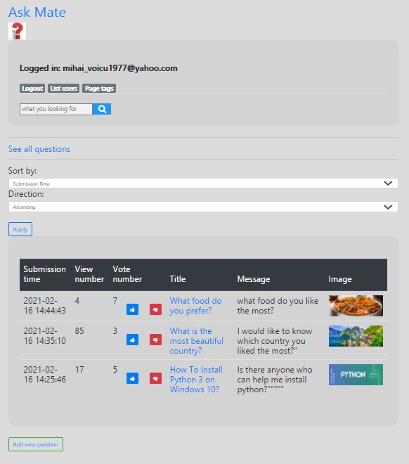
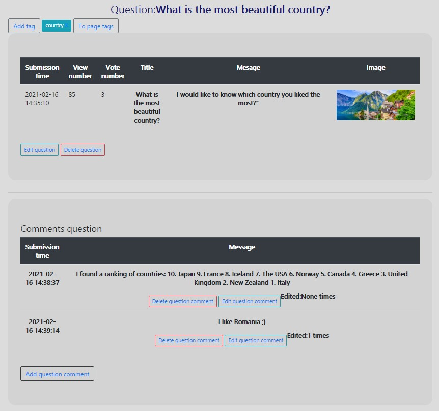
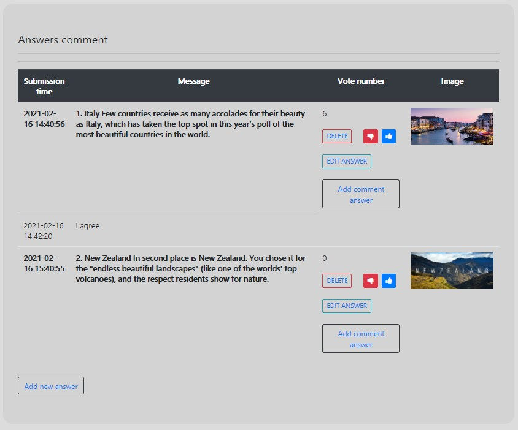

Ask-Mate is a Q&A(is short for 'question and answer. ') application that attempts to answer questions asked by users. A person can add a question, a comment or an answer if is logged.
Each question has subbmision time, number of views, number of votes, title, message and picture.

Home page:

